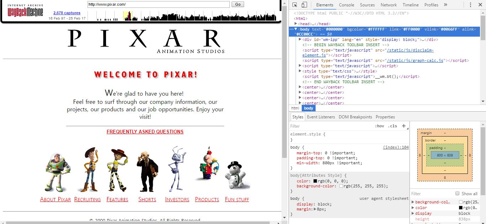
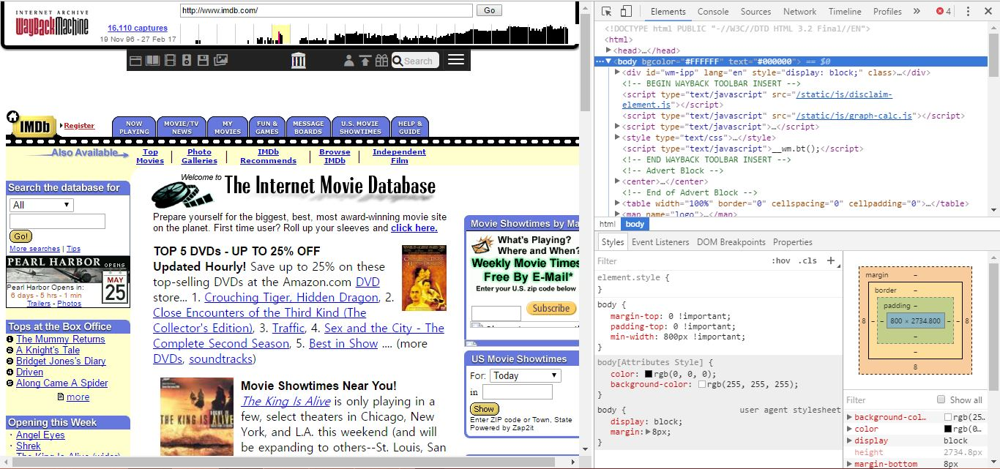

<h2>Week 4</h2>
<h4> Hyein Kang</h4>
<h6>Nick Moles - Section 50</h6>

Technical Report

 

In this week, I learned deeper about HTML. There are different kinds of lists in HTML, such as ordered lists, unordered lists, nested lists and definition lists.
 
Also, I learned semantic markup, which I can change the font, put quotation, definition or etc.
 
I can also link email through a href code.

<h6>Homework</h6>

With Wayback machine, I looked up Pixar and IMDB's Yesteryear Website.

I looked up the Pixar website in 2000, August. It looked totally different with these days website. They had pretty simple website and just few characters in their main page.

I also looked up the IMDB website in 2001. I was surprised that IMDB was existed in that time, having some movies information like these days. But, it looked pretty messy compared to current website.

<h5>Conclusion</h5>
 

I had pretty hard time with this week assignment again, but as I go through it I felt more interested in the assignment. I thought it is great that I have to use some codes from the last assignment. So, I won't forget and I can remember what I learned once again.

